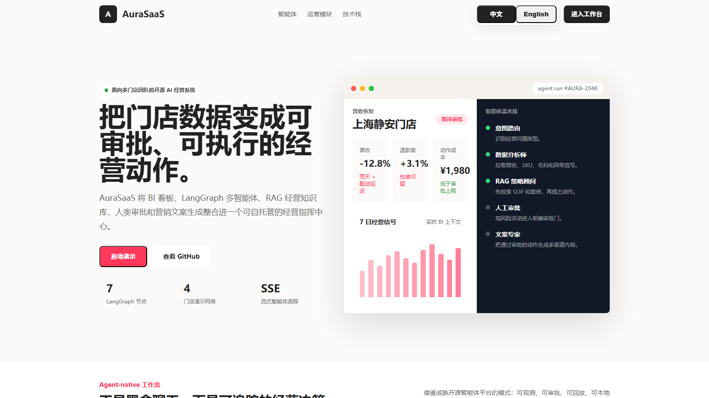
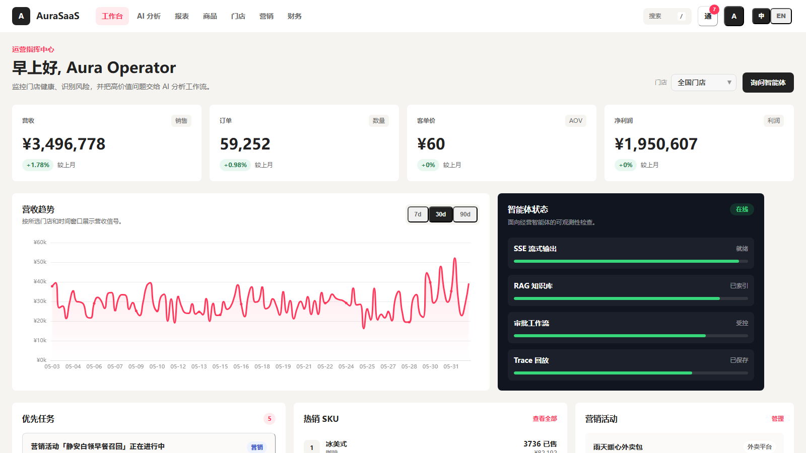
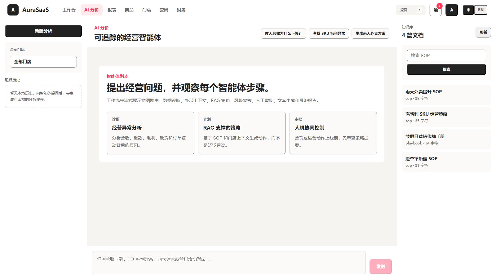

<div align="center">

# AuraSaaS

**开源 AI BI Agent 平台 / Open-source AI BI Agent Platform**

[中文](#中文) | [English](#english)


</div>



---

## 中文

AuraSaaS 是一个面向多门店运营团队的开源 AI BI Agent 平台。它把 BI 看板、LangGraph 多智能体工作流、RAG 经营知识库、人工审批（HITL）和可回放 Trace 组合在一起，把经营数据变成**可追踪、可审批、可执行**的动作。

> 项目持续完善中，当前版本适合本地演示、技术学习、二次开发和开源协作。

### 为什么选择 AuraSaaS

| 能力 | 说明 |
|------|------|
| 🎯 **意图驱动路由** | 根据用户问题自动分支——知识查询只跑 3 个节点，异常诊断跑满 8 节点，不浪费算力 |
| 📊 **经营指挥中心** | 多门店 KPI 总览、营收趋势、热销 SKU 排行榜、优先任务卡片，一键切换门店 |
| 🤖 **可追踪智能体工作流** | 8 个 LangGraph 节点：意图识别 → 数据分析 → 外部上下文 → RAG 策略 → 风险评估 → 人工审批 → 文案生成 → 最终报告 |
| 📚 **RAG 经营知识库** | SOP、营销手册、经营策略文档检索，ChromaDB 向量检索 + 关键词降级双模式 |
| 🛡 **人工审批门 (HITL)** | 高风险策略建议必须先经店长审批，审批通过后自动生成营销活动草稿 |
| ⚡ **实时流式反馈** | SSE 逐节点流式推送——每个 LangGraph 节点完成后即时反馈，无需等待全流程结束 |
| 🔁 **Token 自动刷新** | JWT 过期前自动续期，用户无感知 |
| 🚦 **速率限制** | Agent 端点 5 req/min，通用 API 60 req/min，防止滥用 |
| 🏥 **健康检查** | Docker 内置 healthcheck，30s 间隔自动检测 |
| 📦 **本地一键启动** | FastAPI + SQLite + Vue 3 + Vite + Docker Compose 完整自托管栈 |

### 界面预览

**首页 Landing**


*中英双语首页，展示核心能力和快速入口*

**经营 Dashboard**



*KPI 总览卡片 · 营收趋势图 · 热销 SKU 排行榜 · Agent 就绪状态 · 待处理任务 · 门店切换器*

**AI 分析工作台**



*左侧：门店选择 + 对话历史 · 顶部：快捷提问按钮 · 中间：流式 Agent 对话 + Pipeline 进度条 · 支持审批操作和报告导出*

### Demo 场景

默认演示数据模拟一个咖啡与轻食连锁品牌：

- 🏪 多个城市商圈门店（含评分、座位数、店长信息）
- 📈 每日营收、订单量、客单价、毛利率、退单率、外卖占比
- ⚠️ 内建异常信号：营收骤降、退单率飙升、外卖占比下滑、毛利恶化
- 📚 8 篇 SOP / 策略知识文档（雨天外卖、退单处理、高毛利 SKU、假日营销等）
- 🎯 预置快捷提问：营收诊断、SOP 查询、营销文案、低预算活动

### AI 工作流路由逻辑

```
用户提问
    │
    ▼
┌──────────────┐
│ intent_router │  关键词匹配识别意图
└──────┬───────┘
       │
       ├── knowledge_query ──→ rag_strategist ──→ report_generator  (3 节点)
       ├── dashboard_query ──→ data_analyst ────→ report_generator  (3 节点)
       └── anomaly_diagnosis
           marketing_plan    ──→ 完整 8 节点流程
           report_generation
```

### 技术架构

```text
┌─────────────────────────────────────────────────────┐
│                  Vue 3 Frontend                      │
│  UnoCSS · Pinia · Vue Router · ECharts · Marked      │
│  ┌──────────┬──────────┬──────────┬──────────┐      │
│  │ Landing  │Dashboard │AI 工作台  │ 管理模块  │      │
│  └──────────┴──────────┴──────────┴──────────┘      │
├─────────────────────────────────────────────────────┤
│                  FastAPI Backend                      │
│  ┌──────────┬──────────┬──────────┬──────────┐      │
│  │Dashboard │  Agent   │   RAG    │   Auth   │      │
│  │  APIs    │SSE Stream│  APIs    │  (JWT)   │      │
│  └──────────┴──────────┴──────────┴──────────┘      │
│  ┌──────────────────────────────────────────┐       │
│  │         Middleware Pipeline               │       │
│  │  CORS → RequestContext → RateLimit → App │       │
│  └──────────────────────────────────────────┘       │
├─────────────────────────────────────────────────────┤
│              LangGraph Agent Workflow                │
│  intent_router → data_analyst → fetch_context        │
│       → rag_strategist → risk_controller             │
│       → human_approval → copywriter → report_gen     │
├─────────────────────────────────────────────────────┤
│                    Data Layer                         │
│  SQLite / SQLAlchemy · ChromaDB · Alembic Migrations │
└─────────────────────────────────────────────────────┘
```

### 快速开始

**1. 配置环境**

```bash
cp .env.example backend/.env
```

编辑 `backend/.env`，填入 `DEEPSEEK_API_KEY`（不填则使用 Demo 降级模式）。

**2. 启动后端**

```bash
cd backend
pip install -r requirements.txt
python -m app.scripts.generate_mock_data
python -m app.scripts.ingest_knowledge
uvicorn app.main:app --reload --port 8000
```

**3. 启动前端**

```bash
cd frontend
npm install
npm run dev
```

浏览器打开 `http://localhost:3000`。注册账号后即可使用。

**4. Docker 一键启动**

```bash
docker compose up --build
```

### API 端点速览

| Method | Path | 说明 |
|--------|------|------|
| `POST` | `/api/auth/register` | 注册 |
| `POST` | `/api/auth/login` | 登录 |
| `POST` | `/api/auth/refresh` | Token 续期 |
| `GET` | `/api/auth/me` | 当前用户信息 |
| `GET` | `/api/health` | 健康检查 |
| `GET` | `/api/system/status` | 系统状态（DB/RAG/LLM） |
| `GET` | `/api/system/metrics` | 请求延迟和错误指标 |
| `GET` | `/api/dashboard/overview` | KPI 总览 |
| `GET` | `/api/dashboard/trends` | 营收趋势 |
| `GET` | `/api/dashboard/top-skus` | 热销 SKU 排行 |
| `GET` | `/api/agent/stream-diagnose` | SSE Agent 流式诊断 |
| `GET` | `/api/agent/traces` | 最近 Trace 列表 |
| `GET` | `/api/agent/traces/{trace_id}` | Trace 详情与回放 |
| `POST` | `/api/agent/approve` | 人工审批（通过/驳回/修改） |
| `POST` | `/api/rag/upload` | 上传知识文档 |
| `POST` | `/api/rag/search` | 检索知识库 |
| `GET` | `/api/dashboard/campaigns` | 营销活动列表 |
| `POST` | `/api/dashboard/campaigns` | 创建营销活动 |

### 项目结构

```text
AuraSaaS/
├── backend/
│   ├── alembic/              # 数据库迁移（Alembic）
│   │   ├── versions/         # 迁移脚本
│   │   └── env.py            # 迁移环境配置
│   ├── app/
│   │   ├── agents/           # LangGraph 工作流 + 工具函数
│   │   │   ├── graph.py      # 8 节点 StateGraph + SSE 流式引擎
│   │   │   └── tools.py      # BI 查询、异常检测、RAG、营销工具
│   │   ├── api/              # FastAPI 路由（13 个模块）
│   │   ├── core/             # 配置、安全、限流、响应信封、可观测性
│   │   ├── models/           # SQLAlchemy ORM 模型
│   │   ├── schemas/          # Pydantic 请求/响应模型
│   │   ├── scripts/          # Mock 数据生成 & 知识库导入
│   │   ├── services/         # DeepSeek 客户端 & RAG 服务
│   │   └── tests/            # 16 个单元 + 集成测试
│   ├── alembic.ini
│   ├── requirements.txt
│   └── Dockerfile
├── frontend/
│   ├── src/
│   │   ├── components/       # 可复用 Vue 组件（含 AIAnalysisSidebar）
│   │   ├── composables/      # useAgentAnalysis 业务逻辑
│   │   ├── layouts/          # MainLayout
│   │   ├── stores/           # Pinia 状态管理（auth, dashboard, userProfile）
│   │   ├── utils/            # request.js（异常拦截 + Token 刷新）
│   │   └── views/            # 12 个页面（Landing, Dashboard, AIAnalysis...）
│   ├── vite.config.js
│   └── Dockerfile
├── docs/knowledge/           # 8 篇 SOP / 策略知识文档
├── assets/readme/            # README 截图
└── docker-compose.yml        # 一键启动（含健康检查）
```

### 开发检查

```bash
# 后端
python -m compileall backend/app       # 编译检查
cd backend && pytest app               # 运行测试（16 passed）

# 前端
cd frontend && npm run build           # 构建检查

# 数据库迁移
cd backend && alembic upgrade head     # 应用迁移
cd backend && alembic revision --autogenerate -m "描述"  # 生成新迁移
```

---

## English

AuraSaaS is an open-source AI BI Agent platform for multi-store operations. It combines BI dashboards, LangGraph multi-agent workflows, RAG knowledge retrieval, human-in-the-loop (HITL) approval, and replayable traces to turn business data into **trackable, approvable, and executable** actions.

### Highlights

- **Intent-driven routing** — knowledge queries run 3 nodes, anomaly diagnoses run all 8, saving compute
- **Real-time SSE streaming** — each LangGraph node yields progress immediately via `asyncio.Queue` + threading
- **8-node agent workflow** — intent router → data analyst → external context → RAG strategist → risk controller → human approval → copywriter → report generator
- **RAG knowledge base** — ChromaDB vector search with keyword fallback; 8 built-in SOP documents
- **Human-in-the-loop** — high-risk proposals require manager approval before execution
- **JWT auth with auto-refresh** — token renewal endpoint + frontend interceptor with retry
- **Rate limiting** — 5 req/min for agent endpoints, 60 req/min for general API
- **Alembic migrations** — production-ready schema versioning with autogenerate
- **Docker healthcheck** — automatic container health monitoring

### Quick Start

```bash
# 1. Configure
cp .env.example backend/.env
# Set DEEPSEEK_API_KEY for live LLM (demo mode works without it)

# 2. Backend
cd backend
pip install -r requirements.txt
python -m app.scripts.generate_mock_data
python -m app.scripts.ingest_knowledge
uvicorn app.main:app --reload --port 8000

# 3. Frontend
cd frontend
npm install && npm run dev

# 4. Or Docker
docker compose up --build
```

Open `http://localhost:3000`, register an account, and start asking questions.

### Tech Stack

| Layer | Technology |
|-------|-----------|
| Frontend | Vue 3.4 · Vite 5 · Pinia · ECharts 5 · UnoCSS (Airbnb design tokens) · Marked |
| Backend | FastAPI 0.115 · LangGraph 0.2 · SQLAlchemy 2.0 · Pydantic 2.9 |
| AI | DeepSeek API (chat + reasoner) with 30s timeout + exponential backoff retry |
| RAG | ChromaDB 0.5 (vector) + keyword fallback |
| Auth | JWT (python-jose) + bcrypt · auto-refresh |
| Database | SQLite (demo) · Alembic migrations (PostgreSQL-ready) |
| DevOps | Docker Compose · healthcheck · GitHub Actions CI |

### License

MIT License. Contributions welcome — see [CONTRIBUTING.md](CONTRIBUTING.md) and [GOOD_FIRST_ISSUES.md](GOOD_FIRST_ISSUES.md).
